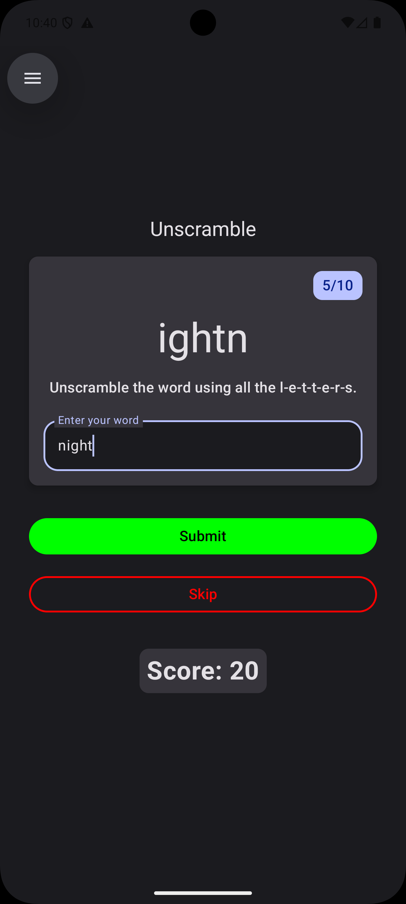
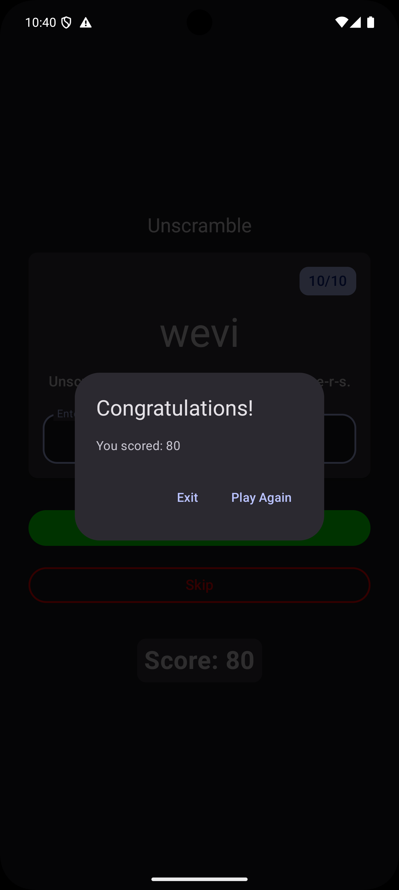

# Unscramble Game

> A Jetpack Compose word-unscramble game showcasing MVVM architecture with ViewModel-driven state, keyboard actions, and an end-of-game dialog.

## Features

- **MVVM Architecture**  
  UI state managed in `GameViewModel` with Kotlin StateFlow.
- **Interactive Gameplay**  
  Enter your guess, submit or skip words—handles wrong guesses gracefully.
- **Keyboard Actions**  
  Supports IME “Done” to submit the guess.
- **End-of-Game Dialog**  
  Displays your final score with options to play again or exit.

## Screenshots

| Game Play            | Final Score Dialog           |
|:--------------------:|:----------------------------:|
|  |  |

## Prerequisites

- Android Studio Arctic Fox or later
- Android SDK (API 21+)
- Kotlin & Jetpack Compose support enabled